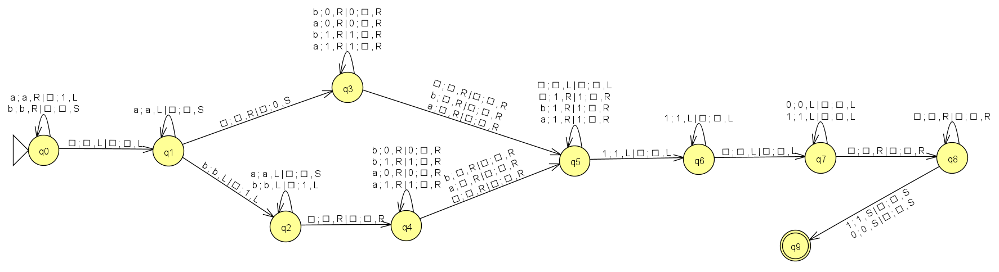

# PRÁCTICA 3:  Programar un simulador de una Máquina de Turing determinista

## Objetivo de la Práctica

El objetivo de la práctica consiste en programar un simulador de una Máquina de
Turing, realizando un diseño orientado a objetos. En este caso las características elegidas han sido las siguientes:

* Máquina de Turing con escritura y movimientos simultáneos

* Máquina de Turing donde permite movimientos izquierda (L), derecha (R) y estática (S).

* Máquina de Turing con cinta infinita en ambas direcciones

---

## Compilación

Para compilar el programa, simplemente navega al directorio `src` y ejecuta el siguiente comando en la terminal:
```bash
make
```

---

## Ejecución

Una vez que el programa haya sido compilado correctamente, podrás ejecutarlo proporcionando los siguientes parámetros a través de la línea de comandos:

```bash
./main <ruta_a_fichero_MT> <cadenas_infinitas_separadas_por_espacios>
```
- **Segundo parámetro**: **<ruta_a_fichero_MT>**
Este parámetro debe contener la ruta al archivo que describe la Máquina de Turing, en este caso los ejemplos de se encuentran en el directorio `ejemplos-MT`. Este archivo incluye la definición de la Máquina de Turing, como sus estados, transiciones y otros elementos relevantes necesarios para su funcionamiento.

- **A partir del tercer parámetro**: **<cadenas_infinitas_separadas_por_espacios>**
A partir de este parámetro, se proporcionarán las cadenas que se desean comprobar. La Máquina de Turing utilizará estas cadenas para determinar si son aceptadas o no, basándose en las reglas y la estructura definidas en el archivo anterior.

***NOTA***: Para la ejecución de la máquina multicinta, es necesario especificar en la línea de comandos cómo estará el contenido de cada cinta. Si deseas que una cinta esté vacía, deberás poner `..`. Para separar las cadenas de cada cinta, utiliza un solo `.`.

En caso de que se produzca algún error en la entrada de los parámetros, el programa mostrará un mensaje de error informando al usuario sobre la naturaleza del problema.

---

## Resultado

Cuando se introducen parámetros válidos en el programa, este realizará lo siguiente:

- **Evaluación de Cadenas**: Para cada cadena proporcionada, el programa determinará si es aceptada por la Máquina de Turing definida en el archivo especificado.
  - **Resultado Aceptado**: Si la cadena es aceptada, el programa mostrará el mensaje "ACEPTADA".
  - **Resultado No Aceptado**: Si la cadena no es aceptada, se mostrará un "RECHAZADA".

Además, al final del procesamiento, se mostrarán el estado final de las cintas, lo que permitirá visualizar claramente cómo quedaron las cadenas después de aplicar las reglas de la Máquina de Turing. También se indicará la posición del cabezal de lectura y escritura (L/E) en cada cinta. Esto facilitará la comprensión del funcionamiento del simulador, ya que los usuarios podrán observar los cambios realizados en las cintas y cómo se realizó el desplazamiento del cabezal durante el proceso.
    
Este enfoque permite tanto una verificación simple de las cadenas como una comprensión más profunda del funcionamiento interno de la máquina cuando se desea observar su comportamiento.

---

## Ejercicios MT

### MT-Ejercicio 1

A continuación se mostrarán tanto las MT's resueltas en JFLAP como la creación de sus ficheros correspondientes:

MT que reconozca el lenguaje `L = { a^n b^m | m > n, n ≥ 0 }`

Ejercicio resuelto con una única cinta:


```bash
q0 q1 q2 q3 q4 q5 q6
a b
a b .
q0
.
q2
q0 b q1 b R
q0 a q3 . R
q1 b q1 b R
q1 . q2 . S
q3 a q3 a R
q3 b q3 b R
q3 . q4 . L
q4 b q5 . L
q5 a q5 a L
q5 b q5 b L
q5 . q6 . R
q6 a q3 . R
q6 b q1 b R
```

***Forma de resolverlo***: La estrategia consiste en eliminar los símbolos `a` de la cadena utilizando un símbolo blanco para suplantarlos. Cada vez que se encuentra una `a`, se borra y se mueve el cabezal al extremo de la cinta para eliminar una `b` correspondiente. Este proceso se repite hasta que no queden más `a's`. Al finalizar, si todavía hay `b's` en la cinta, significa que había más `b's` que `a's`, por lo que la cadena es aceptada. Si no quedan `b's`, se rechaza la cadena, ya que esto indica que el número de `a's` era mayor o igual al de `b's`.

---

### MT-Ejercicio 2

MT que reciba como parámetro una cadena compuesta por símbolos `a` y `b`. La
MT debe sustituir la cadena por el número de símbolos `b`, seguido del número de
símbolos `a` separados por un símbolo `blanco`. El número se codificará como n =
1^n. La cabeza de L/E se quedará al principio del resultado:

**Ejemplo**:

- Cinta inicial (con la cadena de entrada): •abbabaabb•
- Cinta final (con el resultado): •11111•1111•

Si no hay símbolos `b` se escribirá un 0 en sustitución del número.
Si no hay símbolo `a` no se incluirá ningún dato.

**Ejemplos**:

- Cinta al inicio (con la cadena de entrada): •aa•
- Cinta al final (con el resultado): •0•11•

- Cinta al inicio (con la cadena de entrada): •bb•
- Cinta al final (con el resultado): •11•

Ejercicio resuelto con dos cintas:



```bash
q0 q1 q2 q3 q4 q5 q6 q7 q8 q9
a b
a b 0 1 .
q0
.
q9
2
q0 a . q0 a 1 R L
q0 b . q0 b . R S
q0 . . q1 . . L L
q1 a . q1 a . L S
q1 b . q2 b 1 L L
q1 . . q3 . 0 R S
q2 b . q2 b 1 L L
q2 a . q2 a . L S
q2 . . q4 . . R R
q3 a 0 q3 0 . R R
q3 a 1 q3 1 . R R
q3 b 0 q3 0 . R R
q3 b 1 q3 1 . R R
q3 a . q5 . . R R
q3 b . q5 . . R R
q3 . . q5 . . R R
q4 a 0 q4 0 . R R
q4 a 1 q4 1 . R R
q4 b 0 q4 0 . R R
q4 b 1 q4 1 . R R
q4 a . q5 . . R R
q4 b . q5 . . R R
q4 . . q5 . . R R
q5 . . q5 . . L L
q5 . 1 q5 1 . R R
q5 b 1 q5 1 . R R
q5 a 1 q5 1 . R R
q5 1 . q6 1 . L L
q6 1 . q6 1 . L L
q6 . . q7 . . L L
q7 1 . q7 1 . L L
q7 0 . q7 0 . L L
q7 . . q8 . . R R
q8 . . q8 . . R R
q8 1 . q9 1 . S S
q8 0 . q9 0 . S S
```

***Forma de resolverlo***: Para contar los símbolos `a` y `b` en una cadena dada utilizando una máquina de Turing con dos cintas, comenzamos configurando la primera cinta con la cadena a analizar y dejando la segunda cinta vacía. Iniciamos el proceso contando los símbolos `a` en la primera cinta de izquierda a derecha; cada vez que encontramos un `a`, escribimos un 1 en la segunda cinta y movemos el cabezal hacia la izquierda. Este conteo continúa hasta que llegamos al final de la cadena, momento en el cual colocamos un símbolo blanco `.` en la segunda cinta para separar las secciones. Luego, comenzamos a contar los símbolos `b` en la primera cinta. Si no encontramos ningún símbolo `b`, escribimos un 0 en la segunda cinta. Si hay `b`, repetimos el proceso, colocando un 1 en la segunda cinta por cada `b` encontrada y moviendo el cabezal hacia la izquierda hasta llegar al extremo de la cadena. A continuación, comenzamos la etapa de copiar el resultado, a partir de los estados q3 y q4, empezamos a copiar el resultado de la cinta 2 en la cinta 1. Movemos el cabezal de la cinta 2 de izquierda a derecha, copiando todos los símbolos en la cinta 1 y borrándolos de la cinta 2, hasta encontrar el símbolo blanco que separa los conteos; si encontramos otro blanco consecutivo, sabemos que hemos llegado al final de la cadena, sino, simplemente será la separación de conteo y empezaremos a copiar el número de `a's`. Finalmente, para volver a situar el cabezal al inicio de la cadena realizamos el mismo patrón pero en este caso de derecha a izquierda, pero solamente moviéndonos, sin tener que copiar de nuevo.

## Nota adicional

* La ejecución de cadenas en una única cinta es bastante intuitiva, como se explicó anteriormente. Sin embargo, a continuación se presentan una serie de ejemplos de cadenas escritas en la línea de comandos para ilustrar el funcionamiento de la Máquina de Turing multicinta:

- **Ejemplo 1: `100011..1001`**
  - **Cinta 1:** `100011`
  - **Cinta 2:** vacío (debido a los dos `..`)
  - **Cinta 3:** `1001`

  En este caso hay tres cintas, ya que los dos puntos (`..`) indican una cinta vacía.

- **Ejemplo 2: `1.01`**
  - **Cinta 1:** `1`
  - **Cinta 2:** `01`

  Aquí solo hay dos cintas, dado que un único punto (`.`) significa separación entre las cintas.

En caso de especificar menos cadenas que el número total de cintas, las cintas restantes quedarán vacías de forma predeterminada.